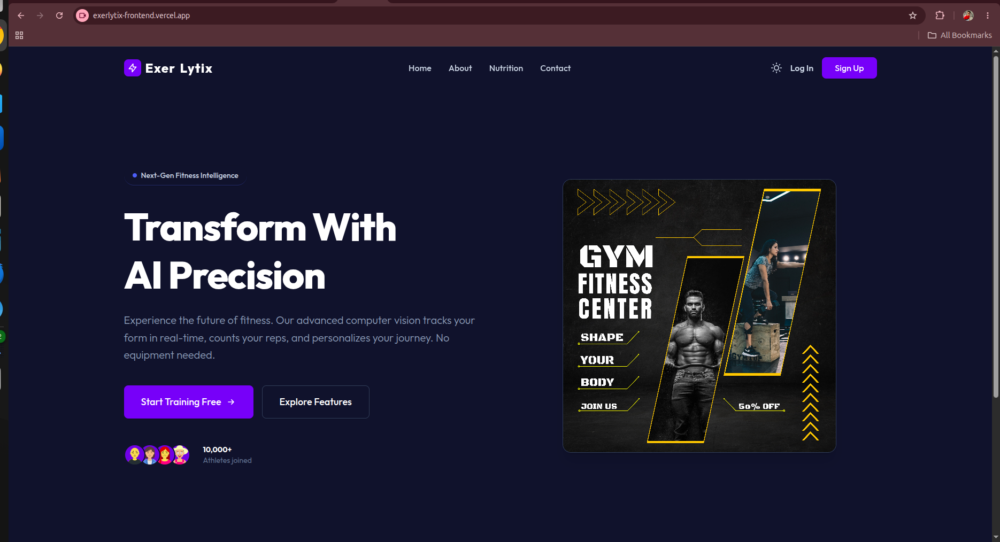
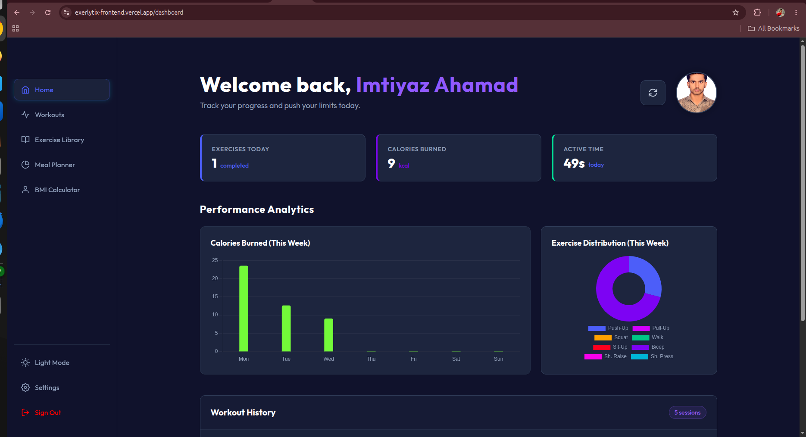
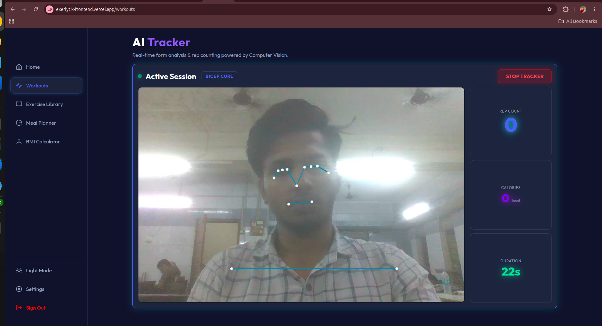
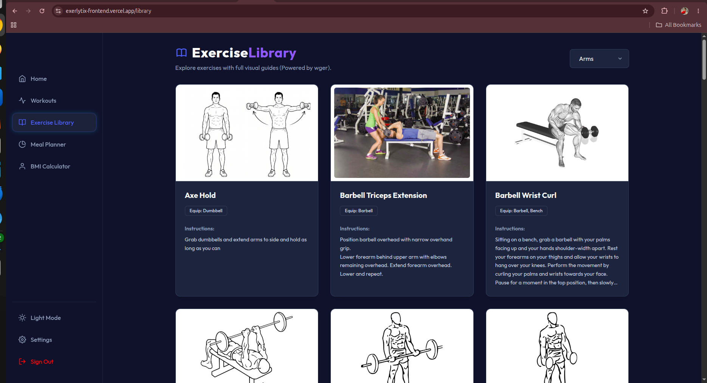
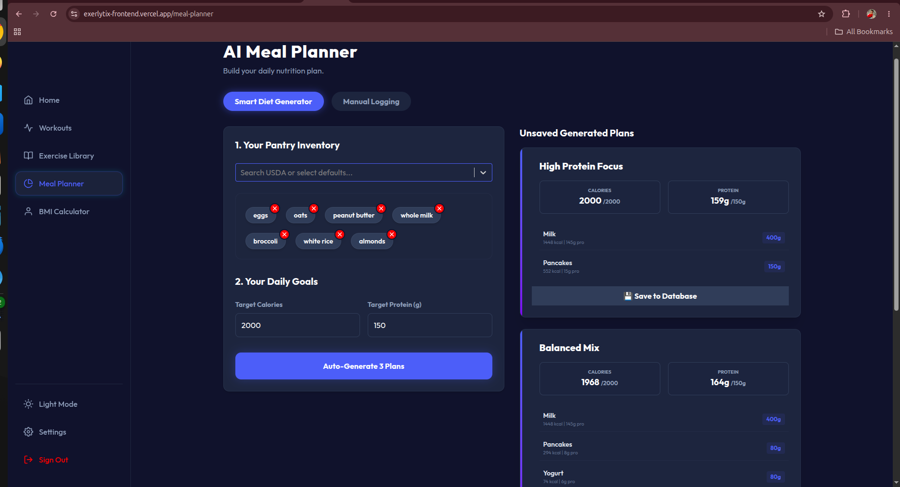
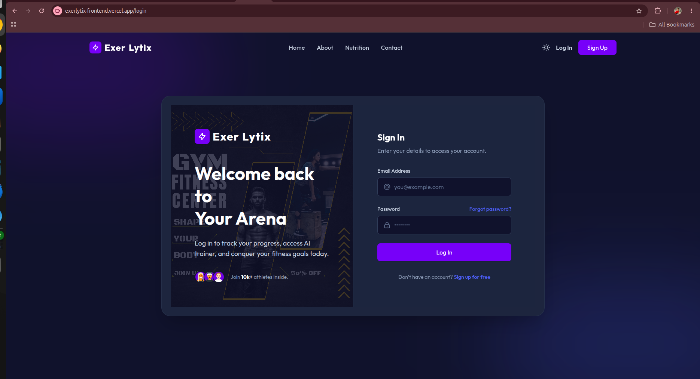
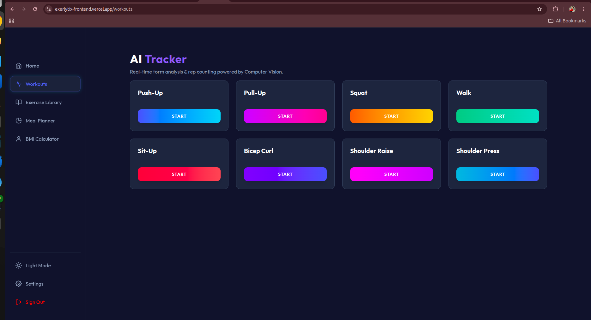

<div align="center">
  

  <h1>🏋️‍♂️ ExerLytix</h1>
  <p><strong>Next-Generation AI-Powered Personal Fitness Tracker & Analyzer</strong></p>
</div>

---

## 🌟 Overview

**ExerLytix** is an enterprise-grade fitness tracking platform that leverages state-of-the-art **Computer Vision (OpenCV) and AI (MediaPipe)** to track workouts, count reps, and analyze posture in real-time. Whether you're doing Bicep Curls or Squats, ExerLytix acts as your personal virtual trainer.

Designed with a scalable, cloud-ready architecture, this project serves as a comprehensive suite for fitness enthusiasts, providing tools for workout tracking, meal planning, BMI calculation, and exercise discovery.

---

## 📸 The Dashboard Experience

<div align="center">
  
</div>

### Feature Showcase

| AI Tracker In Action | Landing Page |
|:---:|:---:|
|  |  |

| Exercise Library | Meal Planner |
|:---:|:---:|
|  |  |

| Authentication | Workouts Setup |
|:---:|:---:|
|  |  |

---

## 🚀 Key Features

*   🤖 **Real-Time AI Form Analysis:** Uses MediaPipe and OpenCV to capture joints, calculate angles, and automatically count reps for various exercises.
*   📊 **Workout Analytics Dashboard:** Visually stunning charts and metrics for daily, weekly, and monthly progress tracking.
*   🥗 **Smart Meal Planner:** Generate and track customized nutrition plans.
*   📚 **Interactive Exercise Library:** Browse through an extensive catalog of exercises with proper form guidance.
*   🔐 **Secure Authentication:** JWT-based secure user authentication and profile management via Spring Security.

---

## 🛠️ Technology Stack & Architecture

This project is built using a microservices-inspired architecture spanning three primary ecosystems:

### 1. Frontend (Client-Side UI)
*   **Framework:** React (Vite)
*   **Styling:** Custom CSS, TailwindCSS (for utility), Glassmorphism Design
*   **Routing:** React Router v6
*   **Data Fetching:** Axios

### 2. Core Backend (Business Logic & Database)
*   **Framework:** Java Spring Boot (Spring Web, Spring Security, Spring Data JPA)
*   **Database:** MySQL (Hibernate ORM)
*   **Auth:** JWT (JSON Web Tokens)

### 3. AI & Computer Vision Engine
*   **Framework:** Python Flask (Waitress/Gunicorn for production)
*   **AI Models:** Google MediaPipe (Pose Landmark Detection)
*   **Computer Vision:** OpenCV (cv2)
*   **Data Processing:** NumPy

---

## 👨‍💻 For Developers: Local Setup & Onboarding

Welcome to the team! Follow these steps to get the entire ExerLytix suite running on your local machine.

### Prerequisites
*   [Node.js](https://nodejs.org/) (v18+)
*   [Java 21](https://jdk.java.net/21/)
*   [Python 3.10+](https://www.python.org/)
*   [MySQL Server](https://dev.mysql.com/downloads/mysql/)

### 1. Setup Java Backend (Port 10000)
1. Create a MySQL database named `exerlytix_db`.
2. Navigate to the `java_backend` directory.
3. Update `src/main/resources/application.properties` with your local MySQL credentials.
4. Run the Spring Boot application:
   ```bash
   ./mvnw spring-boot:run
   ```

### 2. Setup Python AI Engine (Port 5000)
1. Navigate to the `python_ai_backend` directory.
2. Create a virtual environment:
   ```bash
   python -m venv venv
   source venv/bin/activate  # On Windows use: venv\Scripts\activate
   ```
3. Install dependencies:
   ```bash
   pip install -r requirements.txt
   ```
4. Start the Flask server:
   ```bash
   python server.py
   ```

### 3. Setup React Frontend (Port 5173)
1. Navigate to the `frontend` directory.
2. Install Node dependencies:
   ```bash
   npm install
   ```
3. Create a `.env` file in the `frontend` root and add the backend URLs (if not running on standard localhost ports).
4. Start the Vite development server:
   ```bash
   npm run dev
   ```

You can now open `http://localhost:5173` in your browser!

---

## 👥 Contributors & Acknowledgements

This product was brought to life by the following core contributors:

*   **Imtiyaz Ahamad** - Lead Developer & Architect
*   **Khushal Dhumane** - Contributor
*   **Rahul Suwasiya** - Contributor

> *"Transforming the way the world works out, one AI-calculated rep at a time."*

---

## 📞 Contact Information

Feel free to reach us through any of the following ways:

*   📍 **Address:** Sanegruji Watchnalya, Kalwa West, Pincode: 400605, Maharashtra, India
*   📧 **Email:** imtiyazahamad703@gmail.com
*   📞 **Phone:** +91 7039165313

---
<div align="center">
  <p>Built with ❤️ by the ExerLytix Team</p>
</div>
